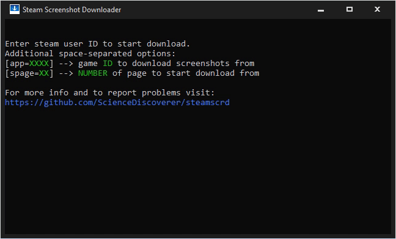

# Steam Screenshot Downloader

[](../../releases/latest)
&nbsp;&nbsp;&nbsp;
&nbsp;&nbsp;&nbsp;[](https://www.buymeacoffee.com/sciencediscoverer)

Download all the screenshots from a public steam profile. No sign-in required. Screenshot description and upload date are embedded directly into the `JPG` file, saved into separate folder for each game. Profanity filter and restricted content is not a problem for this tool.



## How to use

`steamscrd` supports both command line and direct user input interfaces.

### Command line

```
Usage: steamscrd [user_id] [options]
	Options:
	[-app=XXXX] --> game ID to download screenshots from
	[-spage=XX] --> number of page to start download from
```

### Direct input

Launching `steamscrd` without any command line argument activates direct input interface. Just follow the instructions and type in or copy-paste your `ID` and any optional parameters, as needed. Then press `ENTER`.

## How to get `user ID` / `app ID`

`user ID` is a steam user's unique custom identifier. You can find it by visiting the profile page:

```
https://steamcommunity.com/id/[>>>sciencediscoverer<<<]
```
If said user never tried to set up a unique steam profile ID in the options, his/her profile address will look like this:

```
https://steamcommunity.com/profiles/[>>>765611980XXXXXXXX<<<]
```
You can use this number instead.

`app ID` is a steam game's unique identifier. You can get it from the game's store page:

```
https://store.steampowered.com/app/[>>>292030<<<]/_3/
```

## Tips

* You can pause download at any time by pressing `SPACE`. Unpause by pressing `SPACE` again.
* If you (for whatever reason) want to have all your screenshots in a single folder, instead of organised into separate folder for each game, you can use this `CMD` command to copy/move all images to a single folder: `for /r D:\<YOURID> %I in (*.jpg) do copy "%I" D:\ALL_SCREENS`.

## How to build

Just double-click the `msvc_build.cmd` file. Yep. As easy as this. Well, that is, if you have your Visual Studio installed, of course. And if your VS `vcvars64.bat` file is located at this path:

```
set "bat_dir=C:\Program Files\Microsoft Visual Studio\2022\Community\VC\Auxiliary\Build\vcvars64.bat"
```
If not, first of all, make sure the [Visual Studio](https://visualstudio.microsoft.com/downloads/) is installed. In the setup wizard you will see a huge list of useless features and bloat. Only the C++ build tools are actually needed. Switch to `Individual components` and try to find this in the humongous list:

```
MSVC vXXX - VS 202X C++ x64/x86 build tools (Latest)
```

After this you will have to merely locate the `vcvars64.bat` file and copy-paste the path to it into `msvc_build.cmd`. Then just launch it and wait until it does all the job for you. Yes, you don't even need to install or open the Visual Studio IDE itself. Ever. I recommend you to try out my [Notepad++ C++ IDE](https://github.com/ScienceDiscoverer/npp_msvc_ide), if you like the idea of ditching the bloated, laggy and overengineered VS!

## Full video

[](http://www.youtube.com/watch?v=uIicDGLsv4s "Steam Screenshot Downloader")